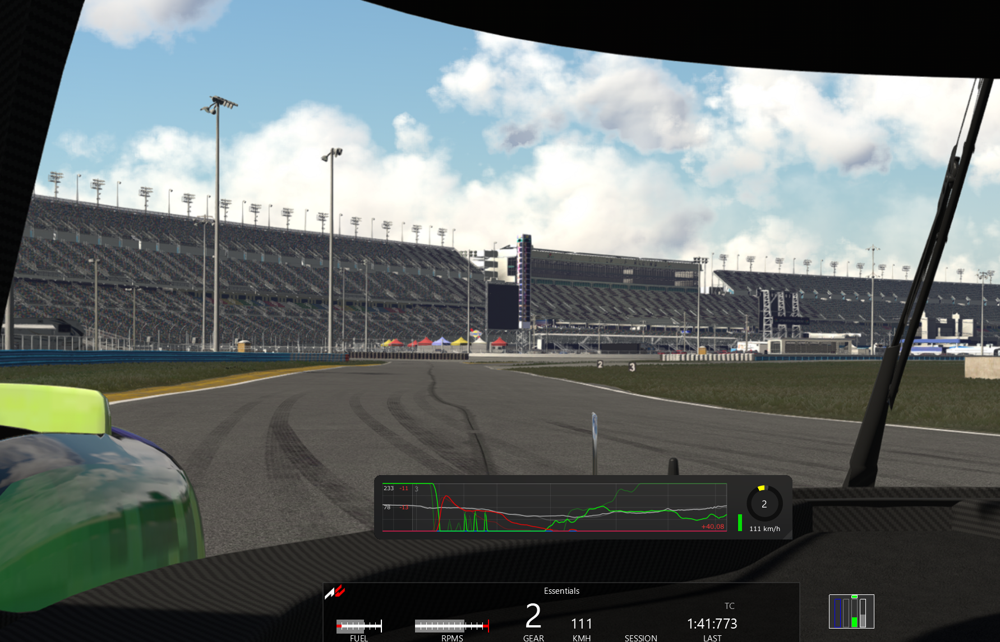

# Traces

A high-performance driver input telemetry app for Assetto Corsa, built with CSP Lua.



## Features

### Real-time Input Visualization
- **Throttle** (green), **Brake** (red), **Clutch** (blue), and **Steering** (gray) traces
- Configurable time window and sample rate
- Smooth, high-frequency recording at 30Hz

### Ghost Lap Comparison
- Automatically records your best lap
- **Best lap persists between sessions** (per track/car combo)
- Displays ghost traces (faint) behind your current inputs
- Shows ghost steering position on the wheel indicator
- Position-synchronized playback ensures accurate comparison regardless of speed
- Reset best lap via configurable hotkey

### Corner Analysis
- Automatic corner detection from ghost lap data
- Corners identified by 30%+ speed reduction with braking
- Visual corner zones that scroll with the trace

### Speed Metrics
Speed labels appear above the trace at the exact position where each speed was recorded:
- **Entry Speed** — Maximum speed before braking
- **Apex Speed** — Minimum speed through the corner
- **Exit Speed** — Maximum speed after full throttle

Each speed shows a delta vs your best lap (green = faster, red = slower).

### Delta Timing
- Corner delta displayed after exiting each corner
- Shows time gained/lost compared to ghost lap

## Installation

1. Requires [Content Manager](https://assettocorsa.club/content-manager.html) with CSP (Custom Shaders Patch)
2. Copy the `traces` folder to:
   ```
   assettocorsa/apps/lua/traces/
   ```
3. Enable the app in Content Manager: Settings → Custom Shaders Patch → Apps

## Hotkeys

Bind a key to **Reset Best Lap** in Content Manager:
- Settings → Assetto Corsa → Controls → Patch → find `APP_TRACES_RESET_BEST`

This clears your stored best lap for the current track/car combination.

## Configuration

Edit `settings.ini` to customize:

```ini
[GENERAL]
use_kmh=True                  ; Use km/h (False for mph)

[TRACES]
display_throttle=True         ; Show throttle trace
display_brake=True            ; Show brake trace
display_clutch=False          ; Show clutch trace
display_steering=True         ; Show steering trace
trace_time_window=12          ; Seconds of history displayed
trace_sample_rate=30          ; Samples per second
trace_thickness=1.5           ; Line thickness in pixels
trace_steering_cap=180.0      ; Max steering angle in degrees
```

## How It Works

### Ghost Recording
The app records your inputs at 15Hz during each lap. When you complete a valid lap that's faster than your previous best, it becomes the new ghost lap. The ghost data includes:
- Track position (spline)
- Lap time
- Throttle, brake, clutch, steering
- Speed

### Position-Based Sync
Unlike time-based ghost systems, Traces syncs by **track position**. This means:
- Ghost traces align perfectly with your current position
- Comparison remains accurate even when stationary
- Corner zones scroll correctly with your progress

### Corner Detection
Corners are detected by analyzing the ghost lap for:
1. Brake application above 15% threshold
2. Speed reduction of 30% or more
3. Entry point set 50m before braking
4. Exit point after 3 seconds of full throttle

## License

MIT
