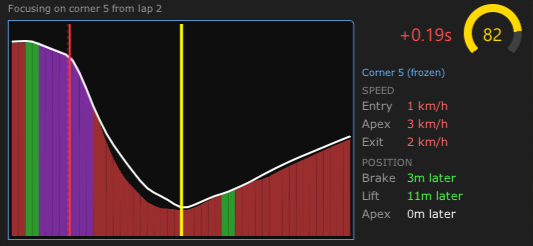
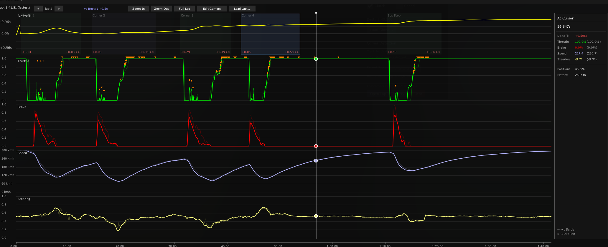

# AC Tracer

A high-performance driver input telemetry and analysis app for Assetto Corsa, built with CSP Lua.

## Installation

[**Download ac-tracer.zip**](https://github.com/tobi/ac-tracer/releases/latest/download/ac-tracer.zip) and drag & drop it onto Content Manager.

## Features

### 🏁 Professional Analysis
- **Corner Analysis**: Automatic detection of corners with detailed breakdowns of:
  - **Entry Speed** (max speed before braking)
  - **Apex Speed** (minimum speed)
  - **Exit Speed** (max speed on exit)
  - **Braking Points** & **Lift-off Points**
- **Live Deltas**: Instant feedback on time gained/lost and speed differences vs reference.

- **Real-time Telemetry**: Visualize Throttle, Brake, Clutch, and Steering traces live as you drive.

### 📊 Data Import & Export
- **MoTeC CSV Support**: Load reference laps directly from MoTeC CSV file exports to compare against real-world data or other simulators.
- **Automatic History**: Your best laps are automatically saved and loaded for every car/track combination.

### 👻 Smart Comparison
- **Ghost Traces**: Faint reference lines show exactly what the faster lap did.
- **Position-Based Sync**: Traces align by track position, not time, ensuring perfect overlays even if you drive slower or stop.
- **Steering Visualization**: See the ghost's steering angle overlaid on your own.

## Configuration

The app is highly configurable via `settings.ini` or the in-game settings window:

- Toggle specific traces (Throttle, Brake, Steering, etc.)
- Adjust time window and sample rates
- Customize units (km/h vs mph)
- Manage reference laps

## Hotkeys

Bind a key to **Reset Best Lap** in Content Manager:
- Settings → Assetto Corsa → Controls → Patch → find `APP_AC_TRACER_RESET_BEST`
