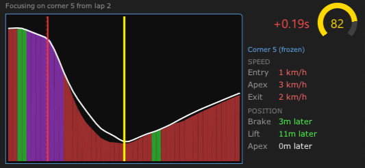
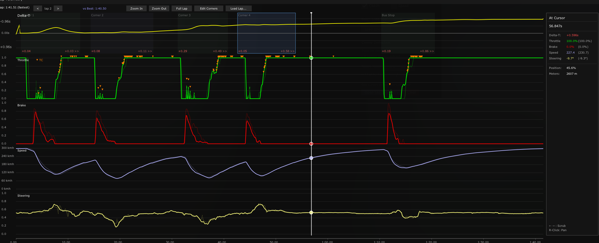

# AC Tracer

A high-performance driver input telemetry and analysis app for Assetto Corsa, built with CSP Lua.

### Watch the Demo

▶️ *Click to watch on YouTube*

## Installation

[**Download ac-tracer.zip**](https://github.com/tobi/ac-tracer/releases/latest/download/ac-tracer.zip) and drag & drop it onto Content Manager.

## Features

### 🏁 Real-Time Traces & Ghost Comparison

- **Live Telemetry Traces**: Visualize Throttle, Brake, Clutch, Steering, Speed, and Gear traces as you drive
- **Ghost Overlay**: Faint reference lines show exactly what the faster lap did at each point
- **Steering Wheel Ghost**: See the reference lap's steering angle overlaid on your wheel indicator
- **Gear Comparison**: Current gear colored green/red when higher/lower than reference
- **Future Traces**: Optionally preview what the reference lap does ahead of your current position
- **Position-Based Sync**: Traces align by track position (not time) for perfect overlays even when stopped

### 📊 Delta Bar

An iRacing-style delta display showing:
- **Live Delta**: Time gained/lost vs reference lap with smooth color gradient (green → red)
- **Corner Score Wedges**: Visual indicators showing your performance in recent corners
- **Lap Completion Display**: Shows completed lap time and final delta for 5 seconds

### 🔍 Corner Analysis

Detailed breakdown for every corner:
- **Entry/Apex/Exit Speeds** with deltas vs reference
- **Braking Points** and **Lift-off Points** with distance deltas (in meters)
- **Max Steering Angle** comparison
- **Mini Speed Graph** showing your line vs reference through the corner
- **Corner Notes**: Coaching feedback (e.g., "Early braking", "Good apex speed", "Lockup detected")
- **Corner Scoring**: 0-100 score for each corner based on speed and technique

### 📈 Lap Telemetry

Full-lap MoTeC-style telemetry comparison:
- Compare any two laps from history side-by-side
- Throttle, Brake, Speed, Steering, and Lateral G traces
- Flag markers showing TC activation, lockups, wheel slip, and pedal overlap
- Corner zones highlighted on the graph
- Auto-hide when driving above configurable speed threshold

### 💾 Checkpoint System (Practice Rewind)

Save your position and teleport back instantly - perfect for practicing specific corners:

- **Save Checkpoint**: Captures car position, velocity, lap progress, and trace history
- **Load Checkpoint**: Teleports back to saved position with full state restoration
- **Audio Feedback**: Distinct sounds for save and load actions
- **Delta Preservation**: Lap time offset is corrected so delta remains accurate after teleport

Bind keys in Content Manager: Settings → Assetto Corsa → Controls → Patch → search for `AC_TRACER`

### 🎯 Brake Markers & Beeps

Visual and audio cues for braking points:

**Brake Markers** (3D lines on track):
- Bright red lines drawn across the track at reference lap braking points
- Modes: Off, Next (upcoming corner only), All (all visible corners within 500m)

**Brake Beep** (audio countdown):
- Countdown beeps at 1.5s, 1.0s, 0.5s, and 0s before brakepoint
- Increasing pitch for each beep
- Source: Reference lap or Session best
- Toggle with configurable hotkey

### 📁 Reference Lap Management

- **Automatic History**: Your laps are automatically saved per car/track combination (persisted across AC restarts)
- **Session Grouping**: Laps organized by current session vs previous sessions
- **MoTeC CSV Import**: Load reference laps from MoTeC CSV exports
- **Quick Selection**: Set any lap as reference with one click
- **Best Lap Tracking**: Separate tracking for overall best and session best

### 🔄 Comparison Modes

Toggle what lap the ghost traces, delta bar, and corner analysis compare against:

| Mode | Description |
|------|-------------|
| **Reference** | The manually selected reference lap (default) |
| **Session Best** | Your fastest lap in the current session |
| **Recent Best** | Your fastest lap across all saved history |
| **Best Corners** | Synthetic lap built from fastest corner segments across all laps |
| **Off** | Disable comparison (no ghost traces) |

The **Best Corners** mode is particularly useful - it creates a "theoretical best" lap by splicing together your fastest performance through each corner, letting you compare against what's actually achievable with your current skill.

Toggle with hotkey or in settings.

### 🏎️ Auto Corner Detection

Corners are automatically detected from your reference lap:
- Detects braking zones and lift-off corners with lateral G
- Uses track sector names when available
- Manual recording also supported (hold button through corner)
- Per-track corner definitions saved as CSV files

### ⚡ Flag Markers

Visual highlights in traces showing driving events:
- **Traction Control**: When TC is intervening
- **Lockups**: Per-wheel lockup detection (FL, FR, RL, RR)
- **Wheel Slip**: Significant wheel spin detected
- **Pedal Overlap**: Throttle and brake pressed simultaneously

## Configuration

The app is highly configurable via the in-game settings window:

**Traces**
- Toggle individual traces: Throttle, Brake, Clutch, Steering, Speed, Gear
- Adjust time window (5-30 seconds) and sample rate (10-60 Hz)
- Enable/disable future traces from reference lap

**Units**
- Speed: km/h or mph

**Markers**
- Toggle flag markers: TC, Lockups, Wheel Slip, Pedal Overlap

**Telemetry Window**
- Auto-hide above configurable speed threshold

**Checkpoint**
- Enable/disable checkpoint system
- Configure save/load keybinds

**Brake Beep**
- Mode: Off, Reference Lap, or Session Best
- Configure toggle keybind

**Brake Marker**
- Mode: Off, Next corner only, or All visible corners

**Comparison Mode**
- Select what to compare against: Reference, Session Best, Recent Best, Best Corners, or Off
- Configure toggle keybind

**Reference Lap**
- Quick access to lap picker
- Load external CSV files

## Hotkeys

Bind keys in Content Manager: Settings → Assetto Corsa → Controls → Patch

| Action | Control Name |
|--------|--------------|
| Reset Best Lap | `APP_AC_TRACER_RESET_BEST` |
| Save Checkpoint | `__AC_TRACER_SAVE_CHECKPOINT` |
| Load Checkpoint | `__AC_TRACER_LOAD_CHECKPOINT` |
| Toggle Brake Beep | `__AC_TRACER_BRAKE_BEEP_TOGGLE` |
| Toggle Comparison Mode | `__AC_TRACER_COMPARISON_MODE` |

## Windows

AC Tracer includes multiple windows that can be toggled from the main trace window:

| Button | Window | Description |
|--------|--------|-------------|
| T | Lap Telemetry | Full-lap MoTeC-style comparison |
| Δ | Delta Bar | iRacing-style delta display |
| R | Reference Lap | Lap picker for selecting reference |
| C | Corner Analysis | Detailed corner breakdowns |

## Technical Notes

- **Sample Rate**: 30 Hz for lap recording, configurable for trace display
- **Brake Pressure**: Uses cphys DLL for real brake pressure in BAR when available
- **Storage**: Uses CSP's `ac.storage` for persistence (no external files except corner CSVs)
- **Performance**: Optimized for minimal impact during driving
